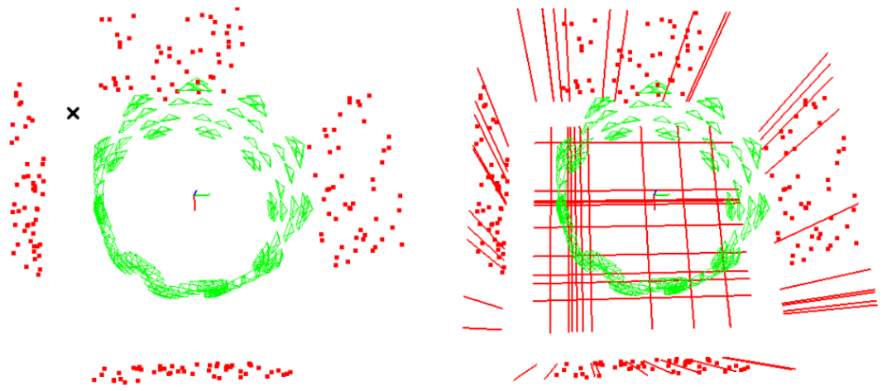
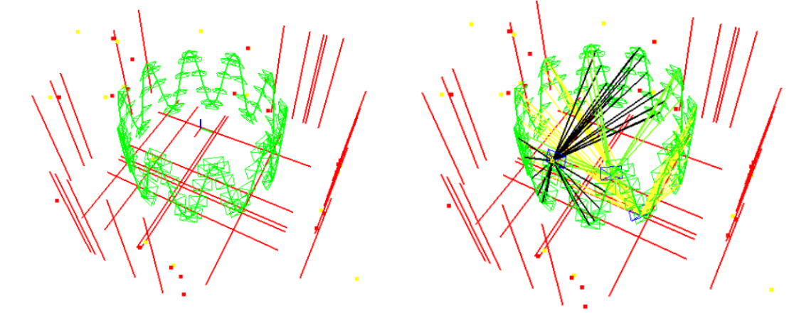

<h1 align="center">
  Venom
</h1> 
<h3 align="center">
 Simulator Software for Pose Estimation
</h3>
<p align="center">
  <a href="https://eccv2022.ecva.net"></a>
  <a href="https://arxiv.org/pdf/2207.10008.pdf"></a>
  <a href="https://TOOD"></a>
  <a href="https://arxiv.org/pdf/2010.07997.pdf"></a>
  <a href="https://arxiv.org/pdf/2008.01963.pdf"></a>
  <a href="https://medium.com/@mgalkin/knowledge-graphs-iclr-2020-f555c8ef10e3"></a>
  <a href="https://">
    
  </a>
    <a href="https://github.com/yanyan-li/VENOM/blob/master/version.md"></a>
</p>

**Authors:** Yanyan Li, Liang Zhao and Federico Tombari

A simulator is a super important tool for testing SLAM modules, especially for newly proposed ideas, as it is easy to check the validity of your ideas in a controlled environment.

#### 1. Prerequisites based on Docker 

Clone the repo, and it is easy to build your own image and container based on the Dockerfile proposed in the **Docker** folder.
The proposed [docker environment](Docker/readme.md) contains the following  libs.

#### Installed environment
Pangolin, OpenCV, Eigen and minor libs have been installed in already.  

#### Choices for optimization.
*Popular optimization libraries including ceres, gtsam and g2o can be selected here based on your particular preferences.* 
Optimization libraries are not installed in advance, but suggestions for installing can be found  [here](thirdparty/readme.md).

#### 2. Simulation introduction 

Red point are ground truth **landmarks**, while reconstructed **mappoints** generated from noisy measurements are yellow. 

Trajectory: Cycle, Sphere and so on.

##### 2.0 Interface of the system

To help users build environments more conveniently, the following software interface is made to design your synthetic environment in a super simple way.

<div align ="center">
	
</div>

You could select the numbers of camera frames, point and line landmarks in the environment via several swipe and click actions as shown in this figure. 

The commands you need are:

```
cd venom
mkdir build
cd build 
cmake ..
make
../bin/main_entrance 
```


##### 2.1 Show Env

```
cd venom
mkdir build
cd build 
cmake ..
make
../bin/show_estimator_env 
```


<h5 align="center">
    Environment 1.
</h5> 




<h5 align="center">
    Environment 2.
</h5> 
<h5 align="center">
    x: frame_id; y: Measurements detected by each frame.(Left: mappoints; Right: maplines. )
</h5> 


<h5 align="center">
    Figure. Left image shows a trajectory, while venom anchors are detected in the right image. 
</h5> 




##### 2.2 Optimization map points 

Commands for testing the simulator

```
cd venom
mkdir build
cd build
cmake ..
make
cd ../bin
./test_pointBA
```


### Related Publications:

If you use Venom in an academic work, please cite:

```
inproceedings{Li2021PlanarSLAM,
  author = {Li, Yanyan and Yunus, Raza and Brasch, Nikolas and Navab, Nassir and Tombari, Federico},
  title = {RGB-D SLAM with Structural Regularities},
  year = {2021},
  booktitle = {2021 IEEE international conference on Robotics and automation (ICRA)},
 }
```
```
inproceedings{Li2020SSLAM,
  author = {Li, Yanyan and Brasch, Nikolas and Wang, Yida and Navab, Nassir and Tombari, Federico},
  title = {Structure-SLAM: Low-Drift Monocular SLAM in Indoor Environments},
  year = {2020},
  booktitle = {IEEE/RSJ International Conference on Intelligent Robots and Systems (IROS)},
 }
```

```
@article{li2022graph,
  title={E-Graph: Minimal Solution for Rigid Rotation with Extensibility Graphs},
  author={Li, Yanyan and Tombari, Federico},
  journal={arXiv preprint arXiv:2207.10008 (ECCV2022)},
  year={2022}
}
```


### Acknowledgement

