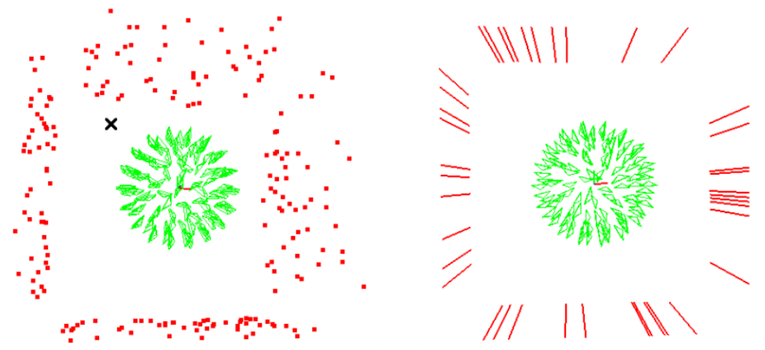

<h1 align="center">
  Venom
</h1> 
<h3 align="center">
 Simulator Software for Pose Estimation
</h3>

<p align="center">
  <a href="https://eccv2022.ecva.net"></a>
  <a href="https://arxiv.org/pdf/2207.10008.pdf"></a>
  <a href="https://TOOD"></a>
  <a href="https://ras.papercept.net/conferences/conferences/ICRA21/program/ICRA21_ProgramAtAGlanceWeb.html"></a>
  <a href="https://www.ieee-ras.org/publications/ra-l"></a>
  <a href="https://medium.com/@mgalkin/knowledge-graphs-iclr-2020-f555c8ef10e3"></a>
  <a href="https://">
    
  </a>
  
</p>

## 
A simulator is a super important tool for testing SLAM modules, especially for newly proposed ideas, as it is easy to check the validity of your ideas in a controlled environment.

```
Architecture:
    src                 ## source files
        |-->estimator   ## responsible for ground-truth/noisy camera poses
            |-->Trajectory.hpp
        |-->feature     ## responsible for 3D reconstruction
            |-->Reconstruct.hpp 
        |-->landmark    ## responsible for ground-truth/noisy landmarks
            |-->MapPoint.hpp
            |-->MapLine.hpp    
        |-->optimizer
            |-->factor  ## responsible for building different factors 
            |-->GlobalBundleAdjustment.hpp
        |-->visulizer   ## responsible for visualozation based on Pangolin
    test                ## entrance for testing
        |-->test_pointBA.cc
        |-->test_show_env.cc
    thirdparty          ## optimization libraries
        |-->gtsam
        |-->ceres
        |-->g2o
    Docker              ## docker environments
```

#### 1. Prerequisites based on Docker 

Clone the repo, and it is easy to build your own image and container based on the Dockerfile proposed in the **Docker** folder.
The proposed [docker environment](Docker/readme.md) contains the following  libs.
#### Installed environment
Pangolin, OpenCV, Eigen and minor libs have been installed in already.  

#### Choices for optimization.
*Popular optimization libraries including ceres, gtsam and g2o can be selected here based on your particular preferences.* 
Optimization libraries are not installed in advance, but suggestions for installing can be found  [here](thirdparty/readme.md).

#### 2. Simulation introduction 

Red point are ground truth **landmarks**, while reconstructed **mappoints** generated from noisy measurements are yellow. 

Trajectory: Cycle, Sphere and so on.

##### 2.1 Show Env

```
cd venom
mkdir build
cd build 
cmake ..
make
../bin/show_estimator_env 
```




​																													Figure 1. Environment 1.


​																													Figure 2. Environment 2.

##### 2.2 Optimization map points 

Commands for testing the simulator

```
cd venom
mkdir build
cd build
cmake ..
make
cd ../bin
./test_pointBA
```


### Related Publications:

If you use Venom in an academic work, please cite:

```
inproceedings{Li2021PlanarSLAM,
  author = {Li, Yanyan and Yunus, Raza and Brasch, Nikolas and Navab, Nassir and Tombari, Federico},
  title = {RGB-D SLAM with Structural Regularities},
  year = {2021},
  booktitle = {2021 IEEE international conference on Robotics and automation (ICRA)},
 }
```
```
inproceedings{Li2020SSLAM,
  author = {Li, Yanyan and Brasch, Nikolas and Wang, Yida and Navab, Nassir and Tombari, Federico},
  title = {Structure-SLAM: Low-Drift Monocular SLAM in Indoor Environments},
  year = {2020},
  booktitle = {IEEE/RSJ International Conference on Intelligent Robots and Systems (IROS)},
 }
```

```
@article{li2022graph,
  title={E-Graph: Minimal Solution for Rigid Rotation with Extensibility Graphs},
  author={Li, Yanyan and Tombari, Federico},
  journal={arXiv preprint arXiv:2207.10008 (ECCV2022)},
  year={2022}
}
```


### Acknowledgement

